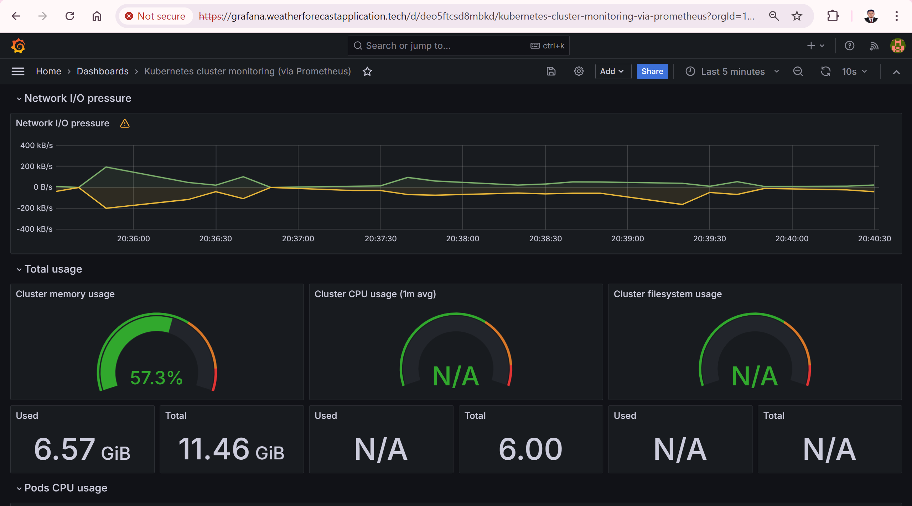
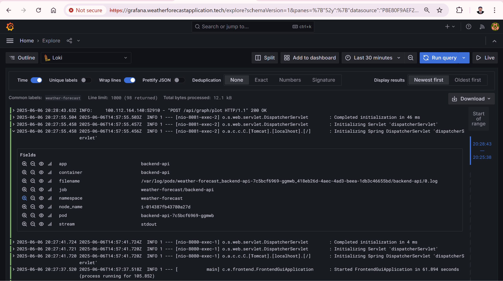
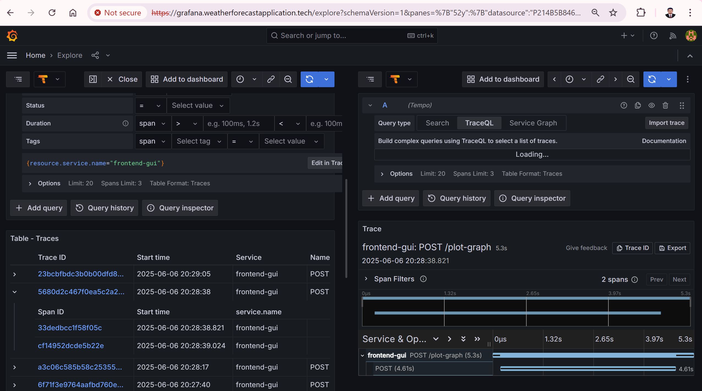

# 📡 Observability App Stack for Kubernetes Microservices

A plug-and-play observability stack for monitoring Kubernetes-based containerized microservices — using open-source tools like **Grafana** , **Prometheus** , **Loki**, and **Tempo**. Fully automated via **Argo CD** with zero additional ALBs.

---

## 🎯 Features

- **📈 Metrics:** Prometheus & Grafana  
- **📊 Logs:** Loki & Promtail  
- **🔍 Traces:** Tempo + OpenTelemetry  
- **🔧 GitOps:** Managed using Argo CD  
- **🌐 Secure:** HTTPS via cert-manager + Let's Encrypt  
- **🚀 NGINX Ingress:** Single ALB for all endpoints  

---

## 🚦 Stack Overview

| Layer    | Tool(s)                          |
|----------|----------------------------------|
| Metrics  | Prometheus + Grafana             |
| Logs     | Loki + Promtail                  |
| Traces   | Tempo (OpenTelemetry-based)      |
| GitOps   | Argo CD                          |
| Ingress  | NGINX Ingress Controller         |
| TLS      | cert-manager + Let's Encrypt     |

---

## 🔧 Setup

1. **Clone this repo**
2. **Apply Argo CD Applications:**
    ```bash
    kubectl apply -f argocd-apps/observability-stack.yaml -n argocd
    ```
3. **Access via Route 53 (Example):**
    - https://grafana.example.com
    - https://prometheus.example.com

---

## 📦 Example Microservice (Java + OTel)

See [`../otel-agent-java/frontend-gui-deployment.yaml`](../otel-agent-java/frontend-gui-deployment.yaml) for a full OpenTelemetry auto-instrumented deployment example.

**Key OTEL Agent Integration:**

```yaml
spec:
    initContainers:
        - name: otel-agent-download
          image: curlimages/curl:8.2.1
          command: [ "sh", "-c" ]
          args:
            - |
              mkdir -p /otel-agent && \
              curl -sSL https://github.com/open-telemetry/opentelemetry-java-instrumentation/releases/latest/download/opentelemetry-javaagent.jar \
                -o /otel-agent/opentelemetry-javaagent.jar
          volumeMounts:
            - name: otel-agent
              mountPath: /otel-agent
    containers:
        - name: <your-app-container>
          # image, ports, and other config...
          env:
            - name: JAVA_TOOL_OPTIONS
              value: >
                -javaagent:/otel-agent/opentelemetry-javaagent.jar
                -Dotel.service.name=<your-service-name>
                -Dotel.exporter.otlp.endpoint=<tempo-endpoint>
                -Dotel.exporter.otlp.protocol=grpc
                -Dotel.traces.exporter=otlp
                -Dotel.metrics.exporter=none
                -Dotel.logs.exporter=none
            # ...other environment variables...
          volumeMounts:
            - name: otel-agent
              mountPath: /otel-agent
    volumes:
        - name: otel-agent
          emptyDir: {}
    # ...other spec fields...
```

**How it works:**
- An `initContainer` downloads the latest OpenTelemetry Java agent JAR.
- The main container uses the agent via `JAVA_TOOL_OPTIONS` for automatic instrumentation.
- OTEL traces are exported to the Tempo distributor.

See the deployment YAML for the full configuration and environment variables.

## 📸 Screenshots

### Prometheus Metrices View



---

### Loki Logs View



---

### Tempo Trace View


